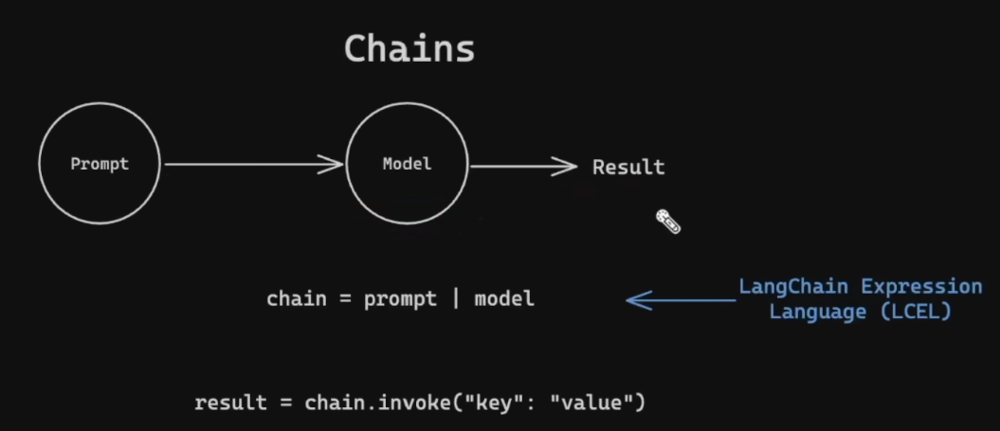
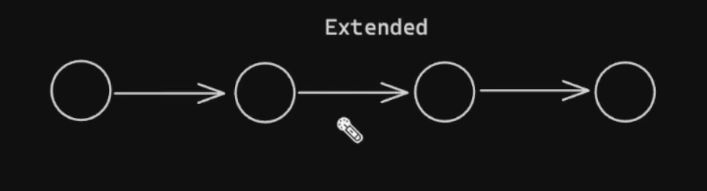
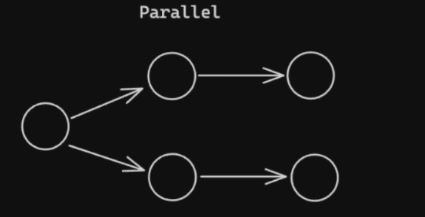
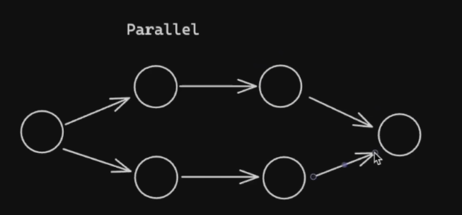
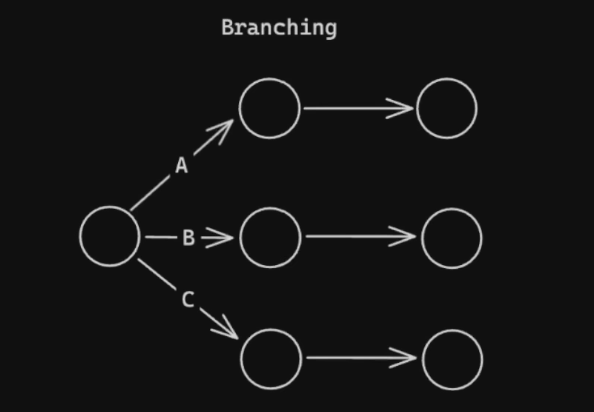

# Chains
# Its nothing but chaining a series of tasks

chain = prompt | model         # langchain expression language (LCEL)

# the symbol  "|" is used to chain responses 

Chain possibilites

1. Extended

2. Parallel

 # parallel and concat

3. Branching

